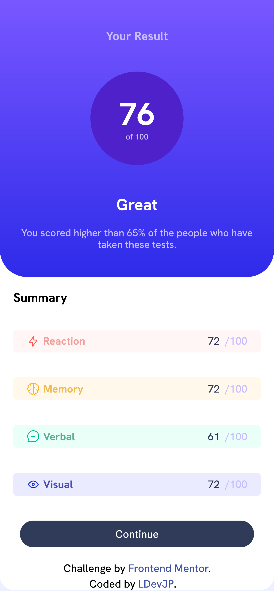
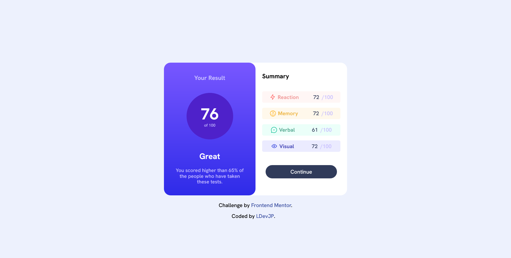

# Frontend Mentor - Results summary component solution

This is a solution to the [Results summary component challenge on Frontend Mentor](https://www.frontendmentor.io/challenges/results-summary-component-CE_K6s0maV). Frontend Mentor challenges help you improve your coding skills by building realistic projects. 

## Table of contents

- [Overview](#overview)
  - [The challenge](#the-challenge)
  - [Screenshot](#screenshot)
  - [Links](#links)
- [My process](#my-process)
  - [Built with](#built-with)
  - [What I learned](#what-i-learned)
- [Author](#author)
- [Acknowledgments](#acknowledgments)

## Overview

### The challenge

Users should be able to:

- View the optimal layout for the interface depending on their device's screen size
- See hover and focus states for all interactive elements on the page
- **Bonus**: Use the local JSON data to dynamically populate the content

### Screenshot

### Links

- Solution URL: [GitHub-Solution](https://github.com/LDevJP/FM-ResultSumaryComponent)
- Live Site URL: [Netlify](https://fm-results-sumary-component.netlify.app/)

## My process

### Built with

- Semantic HTML5 markup
- CSS custom properties
- Flexbox
- Mobile-first workflow
- [Vite] (https://vitejs.dev/) - development environment
- [Sass](https://sass-lang.com/) - CSS preprocessor

### What I learned

I learned how to use the vite development environment to create the project, and I also learned about the Sass processor for styles, about its variables, etc.

## Author

- Website - [Luigui PJ](https://github.com/LDevJP)
- Frontend Mentor - [@Luigui PJ](https://www.frontendmentor.io/profile/LDevJP)

